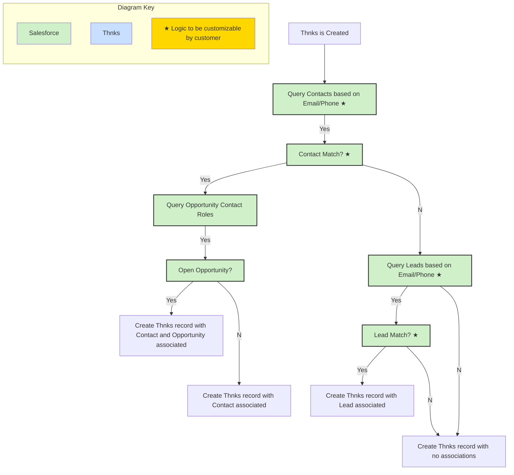

## Thnks Data Model

### Thnks Object

<Frame>
  
</Frame>

### Thnks Record Creation

The following events trigger a change on the Salesforce side (either creating or updating records):

* A new Thnks is sent

* The status of an existing Thnks is changed (e.g. opened, undelivered, redeemed, etc.)

Upon creation, this is the general flow of what is occurring (note that a Task being created is possible at the very end, but this is not being shown in this diagram):

<Frame>
  
</Frame>

So as you can see, when a Thnks record is being created, Salesforce is checking the following:

* Is there a Contact to match?

* If no Contact is found, is there a Lead to match?

* If a Contact is found, is there an open Opportunity to match?

### Thnks Record Updates

After the initial Thnks is sent and the subsequent Thnks record in Salesforce is created (and potentially a Task), there will be no additional new records being created.

Instead, all that will be changing is the Status field (API name of thnksdev1\_\_RecipientTransactionStatus\_\_c) on the Thnks record whenever the status on the Thnks side is updated

### Task Logging for Thnks

If you have enabled “Task Syncing” in the Configuration tab, then every time a Thnks is sent, a Task will be automatically generated. There are two standard fields on Tasks for association with other records: Name and Related To (API Names of WhoId and WhatId, respectively).

The WhoId (Name) field can only be related to Leads or Contacts. The WhatId (Related To) can be related to any other object. For our purposes, the WhatId will always be related to the Thnks record.

* If the Thnks is associated with a Lead, then the Task will only be associated with the Thnks record via the Related To field (WhatId). The WhoId cannot be used in this scenario due to Salesforce limitations.

<Frame caption="Task for a Thnks Record Associated with a Lead">
  
</Frame>

* If the Thnks is associated with a Contact, then the Task will be associated with the Thnks record via the Related To field (WhatId), as well as the Contact via the Name (WhoId) field.

<Frame caption="Task for a Thnks Record Associated with a Contact">
  
</Frame>

* If the Thnks is not associated with a Lead nor a Contact, then the Task will only be associated with the Thnks record via the Related To field (WhatId),