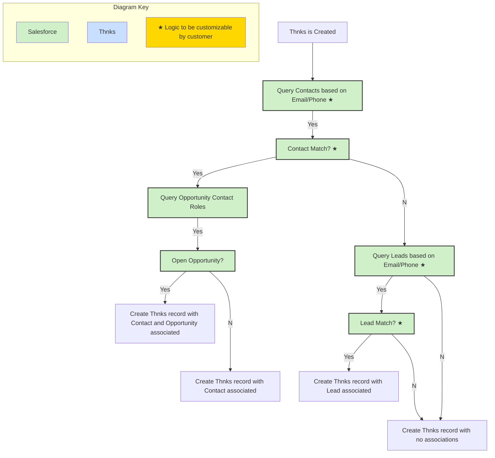

The custom Thnks objects allow you to build more robust reporting and understand your ROI by pulling detailed reports on user activity and messaging effectiveness.

New features of the App:
* Automatic association of the Thnks object with open Opportunities and Accounts (in addition to Lead or Contact)
* More streamlined reporting on key date/time stamping on Thnks Status (delivered, opened, redeemed, etc.)
* Pre-built dashboard and underlying reports
* Admin configuration page to control:
  * How Thnks is matched when there are duplicate Contacts, Leads, or Opportunities
  * Toggle for matching to Opportunities
  * Toggle for creating Tasks
  * What to do when no matching Lead/Contact is found
  * Matching on custom phone and/or email fields on the Lead and Contact
* Enhanced Activity logging via the Task object
* Support for Thnks Required Field syncing

## Integration Overview

Thnks has partnered with Salesforce to provide our clients with an application built specifically for Salesforce and available on the AppExchange. Currently, this is a one-way integration, meaning that data is being sent from the Thnks product into your Salesforce environment.

## What Does It Do?

The Thnks Salesforce AppExchange application provides enhanced reporting capabilities by creating a Thnks record within Salesforce whenever a Thnks transaction is initiated.
The data model in Salesforce is simple: there is a single object called “Thnks”, which is created shortly after a Thnks is sent out, and then updated as the status changes. Additionally, there is automation that is controlled within the Salesforce App (which you may customize the logic for) which determines what records in Salesforce a Thnks is associated with (Lead, Contact, Account and Opportunity). You may also configure a Task to be created so you can have visibility of Thnks in Salesforce’s standard activity feed.

Date/times are stamped on the Thnks record as the Thnks is delivered, undelivered, opened, redeemed, expired, refunded and/or donated.

## How Does It Work?

When a Thnks user sends a Thnks, whether it’s via the web/mobile app, Chrome extension, an automated webhook, or a scheduled campaign, a record with the transaction information is created as a Thnks in Salesforce. As part of the creation of the Thnks record, and depending on what settings you have customized, the following may happen:
* Thnks is associated with a Lead or Contact (never both)
  * If Thnks is associated with a Contact, Thnks is associated with an open Opportunity if that Contact is tied to an Opportunity via the Opportunity Contact Role object
  * If Thnks is associated with a Contact, the Account that the Contact belongs to is also associated with the Thnks record
  * It is also possible that no association is made, if no matching Contact or Lead is found
* A Task is created, associated with the Thnks record as the WhatId, and the Contact as the WhoId (more on this below)
* As the Thnks transaction moves through various statuses (e.g. Opened, Redeemed), the Status field on the Thnks record will update accordingly, and the date and time at which this occurs will be stamped on dedicated fields
* Other important details about the Thnks are included in the sync and placed on fields on the Thnks object such as the sender, various pricing fields, the Transaction ID, a link to the Thnks, and any custom fields you configure within the Thnks App.

## System Requirements

Below please find more information on the necessary requirements before installing our Salesforce App in your instance of Salesforce.

### Supported Salesforce Editions

| Salesforce Editions |                            |
| ------------------- | ------------------------------------- |
| Professional        | [Salesforce Professional Edition](https://www.salesforce.com/editions-pricing/sales-and-service-cloud/) provides Web Services API as an optional add-on. |                   |
| Enterprise          |                                       |
| Unlimited           |                                       |
| Developer           |                                       |

## Installation

In this section, we’ll walk through installing the AppExchange application in your Salesforce instance. These instructions are meant to be a high-level overview, please contact your Salesforce Administrator to discuss the process for installation onto your specific instance and to determine whether or not a Sandbox should be used first.

### Preparing Your Thnks Account for Salesforce

Contact your Thnks Account Manager (or support@thnks.com) to enable the Salesforce App connection in your organization’s Thnks account. 

Thnks offers two ways to connect your users’ Thnks activity to Salesforce:

* **User Connection** - each user must enable their own Thnks \<\> Salesforce connection via their Thnks account profile. 
  * Note: if a user does not enable their connection, their Thnks activity will not appear in Salesforce.
* **Org Connection** - an SF admin can enable a single connection between Thnks and Salesforce. Individual users will not have to perform their own connections. 
  * Note: For Thnks activity to appear in Salesforce, the email address of the Thnks user must match the email address of their Salesforce account.

### Installing from the AppExchange

To install Thnks, you’ll need to navigate to the Thnks App listing in the Salesforce AppExchange. [Here](https://appexchange.salesforce.com/appxListingDetail?listingId=a0N3A00000FN7gUUAT&preview=%222021-02-10T20%3A06%3A08.000Z%22) is a direct link. Click on **“Get It Now”**, make sure you’re logged into the correct account, and a dialog box will appear: 

<Steps>
  <Step title="Choose The Instance">
    Select the correct Salesforce instance, and decide whether you want to install in Production or in Sandbox, and proceed.
  </Step>
  <Step title="Confirm Details">
    After confirming details and agreeing to the terms and conditions, click “Confirm and Install” to continue.
  </Step>
  <Step title="Determine Install Preferences">
    Lastly, determine which users you’d like to initially install the application for. 
      We recommend installing for specific profiles or for admins only and reconfiguring as needed.
      <Frame>
      
      </Frame>
  </Step>
</Steps>

If selecting **“Install for Specific Profiles”**, you will be able to choose one of three options for each individual profile:

* No Access (Users with this profile will not be able to see any Thnks data)
* Thnks Standard User (Users with this profile will be able to view all Thnks data, but will not be able to configure the Thnks settings)
* Thnks Admin (Users with this profile will be able to view and edit all Thnks data, as well as configure the Thnks settings)

<Frame>

</Frame>

At this point, you should receive an email from Salesforce confirming successful installation and should be redirected to this page with all of your installed packages. You’ve successfully installed the Thnks Salesforce App!

### Upgrading from v1.1 to v1.3 of the AppExchange Listing

If you have an old version of the Thnks AppExchange app installed in your instant of Salesforce, please follow the same instructions for install as if you were installing for the first time as seen above using [this link](https://appexchange.salesforce.com/appxListingDetail?listingId=a0N3A00000FN7gUUAT&preview=%222021-02-10T20%3A06%3A08.000Z%22).

The main considerations to keep in mind when upgrading:
* The Thnks Status Log object will no longer be syncing records (but the old records will remain)
* There will be many new fields on the Thnks object, such as Opportunity and Account lookups, as well as several new date/time fields to replace the need of the Thnks Status Log
* There is now a tab called “Manage Thnks Settings” to configure various settings in the integration (see “Thnks Configuration” section below)

#### Backfilling Thnks Records in 1.3

If you have upgraded from 1.1 to 1.3, you will now notice that the Thnks Status Log object is no longer being used. Instead, there are new date/time fields to track the status of key events such as “Delivered Date/Time”, “Redeemed Date/Time”, etc.

In order to backfill your historical Thnks records from 1.1 with the correct dates for these new fields, you’ll need to have a user with the Thnks admin permissions in Salesforce head to the “Manage Thnks Settings” and click “Enrich Old Thnks”. 

<Frame>

</Frame>

This will automatically scan all Thnks Status Log records, take the date/time for each key event, and then backfill the fields in this section on the Thnks object.

<Frame>

</Frame>

### Permissions

#### Install

<Frame>

</Frame>

#### Manually Updating Permissions

If after installing the Thnks app following the install instructions above you need to change permissions, the recommended path is by assigning Permission Sets to the appropriate Users. Alternatively, you may also grant permissions to the Thnks objects at the Profile level.

<Steps>
  <Step title="Enter Setup">
  </Step>
  <Step title="Click Into Profiles Under the User Section">
    <Frame>
    
    </Frame>
  </Step>
  <Step title="Select the Profile You Wish to Change">
  </Step>
  <Step title="Click Edit at the Top of the Page">
    <Frame>
    
    </Frame>
  </Step>
  <Step title="Scroll Down to “Custom Object Permissions” and Look for “Thnks”">
    <Frame>
    
    </Frame>
  </Step>
  <Step title="Check the Various Access You Wish for This Profile to Have (Read, Create, Edit, Delete, View All, Modify All)">
    <Frame>
    
    </Frame>
    You can ignore Thnks Status Logs, as this is no longer used in the integration

    View All would be the recommended access for the majority of end users
  </Step>
</Steps>

#### Permission Sets

Alternatively, you can assign a Permission Set to individual users. From Setup, click into Users, and then choose any User which you wish to grant additional permissions to. Under “Permission Set Assignments”, click “Edit Assignments”. 

<Frame>

</Frame>

There are two Permission Sets to choose from:
*	Thnks Admin (grants View/Modify All access to the Thnks object, as well as allowing this User to configure the Thnks settings)
*	Thnks Standard User (grants View All access to the Thnks object)
  <Frame>
  
  </Frame>

## Thnks Configuration

Once you have Thnks installed in your Salesforce environment, you will want to review the integration settings. If you click the App Launcher in Salesforce (this is the 9 dots in the top left), and then type in “Thnks”, the item “Manage Thnks Settings” should appear. Click into that.
  <Frame>
  
  
  </Frame>

There are 5 tabs:
* Contact Settings
* Lead Settings
* Opportunity Settings
* Fields Mapping
* Others
  <Frame>
  
  </Frame>

Each tab comes pre-configured with default settings. If you wish to change these settings, there is an “Edit” button in the top right corner.

### Contact Settings

This tab is where you can customize the logic that Salesforce will use for matching Thnks records with existing Contacts in your Salesforce instance. Since Thnks are sent either using email or SMS, this means that there will be two different fields to match against: an email address or a phone number. By default, the email field being used is the standard Email field (API name of “Email”), and the phone field being used is the standard Phone field (API name of “Phone”).

However, you can change these so that Thnks matches Contacts based on any other field that is of type Email or Phone, respectively.
  <Frame>
  
  
  </Frame>

On the right side, you will see the fields “Contacts Order By” and “Order Direction”. This is solely used for the purpose of determining which Contact to choose if you have duplicate Contacts. The definition of a duplicate is determined in this context by your Salesforce instance having more than one Contact that has the same value for the Email or Phone field you are using for matching. 

As an example, if you send a Thnks to someone with the email johndoe@gmail.com, you are matching using the standard Email field, and there are two Contacts with the exact email of johndoe@gmail.com, Salesforce will identify that there are two potential matches.

The Contacts Order By field allows you to control what field you wish to use to determine which Contact to use, and the Order Direction controls the logic. 

Example: if you want to choose the oldest Contact based on Created Date, you would select “Created Date” as the “Contacts Order By” field, and “ASC” for ascending in the “Order Direction”.
  <Frame>
  
  </Frame>

However, if you wanted to choose the Contact with the most recent activity, you would select “Last Activity” and “DESC”.
  <Frame>
  
  </Frame>

### Lead Settings
The concept of configuring the Lead matching is exactly the same as the Contact. Please see the above section on Contact Settings, and you can customize different logic for the Lead. Again, you can only use Email and Phone type fields for the matching logic.

The matching logic you use for the Contact has no impact on the matching logic for the Lead, and vice versa.

### Opportunity Settings

The Opportunity matching is even more simple. There are two things you can configure:
1.	Whether or not you wish to match Opportunities
2.	Similar to Leads and Contacts, how to decide which Opportunity you wish to match in the scenario that there is more than one matched Opportunity

Opportunities can only be matched if the following criteria are met:
1.	A Contact is matched to the Thnks record
2.	That Contact is associated with 
3.  The Opportunity is open

### Fields Mapping

The Fields Mapping tab enables you to map custom properties from within the Thnks app onto the Thnks object in Salesforce. These are custom, required fields that you can prompt users to enter when sending a Thnks. The below is just an example, as these field names will be unique to your Thnks account.
  <Frame>
  
  </Frame>

If you create any fields on the Thnks side, you will also need to manually create the field in Salesforce with the appropriate field type (most likely these will be text or picklist).

Contact your Thnks Account Manager to coordinate the addition of Thnks Required Fields.

### Others

<Frame>

</Frame>

The last tab is for miscellaneous settings, which for now consists of two primary features:
* How to handle Thnks when no Lead or Contact match is found
* Syncing Thnks as Activities (Tasks)

In the scenario where a Thnks is sent and the phone number or email address used is unable to find a corresponding match with a Salesforce Lead or Contact, then you have one of two options:
* Create Thnks (with no matching Lead or Contact)
* Do not create a Thnks
  <Frame>
  
  </Frame>

The other three fields in this section deal with the creation of Task records:
* First, the Task Syncing field is a simple toggle of whether or not Tasks should be created. If this is checked, a Task will be created and it will be associated with both the Thnks record and a Contact. If the Thnks is associated with a Lead, then only the Thnks record will be associated (Tasks cannot be associated with a Lead and another object). More on the Task fields being set below.

## Thnks Data Model

### Thnks Object

<Frame>

</Frame>

### Thnks Record Creation

The following events trigger a change on the Salesforce side (either creating or updating records):
*	A new Thnks is sent
*	The status of an existing Thnks is changed (e.g. opened, undelivered, redeemed, etc.)

Upon creation, this is the general flow of what is occurring (note that a Task being created is possible at the very end, but this is not being shown in this diagram):

<Frame>

</Frame>

So as you can see, when a Thnks record is being created, Salesforce is checking the following:
* Is there a Contact to match?
*	If no Contact is found, is there a Lead to match?
*	If a Contact is found, is there an open Opportunity to match?

### Thnks Record Updates

After the initial Thnks is sent and the subsequent Thnks record in Salesforce is created (and potentially a Task), there will be no additional new records being created.

Instead, all that will be changing is the Status field (API name of thnksdev1__RecipientTransactionStatus__c) on the Thnks record whenever the status on the Thnks side is updated

### Task Logging for Thnks

If you have enabled “Task Syncing” in the Configuration tab, then every time a Thnks is sent, a Task will be automatically generated. There are two standard fields on Tasks for association with other records: Name and Related To (API Names of WhoId and WhatId, respectively).

The WhoId (Name) field can only be related to Leads or Contacts. The WhatId (Related To) can be related to any other object. For our purposes, the WhatId will always be related to the Thnks record.

*	If the Thnks is associated with a Lead, then the Task will only be associated with the Thnks record via the Related To field (WhatId). The WhoId cannot be used in this scenario due to Salesforce limitations.
  <Frame caption="Task for a Thnks Record Associated with a Lead">
  
  </Frame>
*	If the Thnks is associated with a Contact, then the Task will be associated with the Thnks record via the Related To field (WhatId), as well as the Contact via the Name (WhoId) field.
  <Frame caption="Task for a Thnks Record Associated with a Contact">
  
  </Frame>
*	If the Thnks is not associated with a Lead nor a Contact, then the Task will only be associated with the Thnks record via the Related To field (WhatId),

### Thnks Object Data Dictionary

Below is a table with the default labels, API names and definitions for all fields that come with the AppExchange listing within the Thnks object.

**Object Label**: Thnks
**Object API Name**: thnksdev1__Gift__c

| Field Label               | API Name                                      | Field Type                        | Purpose                                                                 |
|---------------------------|-----------------------------------------------|-----------------------------------|-------------------------------------------------------------------------|
| [Account](https://thnkscandyboxapp-dev-ed.develop.lightning.force.com/lightning/setup/ObjectManager/01IHr000001kr7E/FieldsAndRelationships/00NHr00000AokK6/view)                   | thnksdev1__Account__c                         | Lookup(Account)                   | Account that Thnks is related with (only associated if a Contact match is made). |
| [Actual Sender](https://thnkscandyboxapp-dev-ed.develop.lightning.force.com/lightning/setup/ObjectManager/01IHr000001kr7E/FieldsAndRelationships/00NHr00000D0cwH/view)             | thnksdev1__Actual_Sender__c                   | Lookup(User)                      | Internal Salesforce User that initiated the sending of the Thnks.       |
| [Carbon Neutral Cost](https://thnkscandyboxapp-dev-ed.develop.lightning.force.com/lightning/setup/ObjectManager/01IHr000001kr7E/FieldsAndRelationships/00NHr00000HBzXL/view)       | thnksdev1__Carbon_Neutral_Cost__c             | Currency(16, 2)                   | Cost for carbon-neutral Thnks delivery.                                 |
| [Created By](https://thnkscandyboxapp-dev-ed.develop.lightning.force.com/lightning/setup/ObjectManager/01IHr000001kr7E/FieldsAndRelationships/CreatedBy/view)                | CreatedById                                   | Lookup(User)                      | Standard Salesforce field displaying what user created the record. Will be the same as Actual Sender. |
| [Deal Stage](https://thnkscandyboxapp-dev-ed.develop.lightning.force.com/lightning/setup/ObjectManager/01IHr000001kr7E/FieldsAndRelationships/00NHr00000H9Ucy/view)                | thnksdev1__Deal_Stage__c                      | Text(255)                         | If an Opportunity is matched, this is a stamp of the Opportunity’s Stage at the time of Thnks send. |
| [Delivered](https://thnkscandyboxapp-dev-ed.develop.lightning.force.com/lightning/setup/ObjectManager/01IHr000001kr7E/FieldsAndRelationships/00NHr00000Elefs/view)                 | thnksdev1__Delivered__c                       | Formula (Checkbox)                | Indicates whether the Thnks has been delivered to the recipient.        |
| [Delivered By](https://thnkscandyboxapp-dev-ed.develop.lightning.force.com/lightning/setup/ObjectManager/01IHr000001kr7E/FieldsAndRelationships/00NHr00000Ait5J/view)              | thnksdev1__DeliveryType__c                    | Picklist                          | Whether Thnks was sent via Email or SMS.                                |
| [Delivered Date/Time](https://thnkscandyboxapp-dev-ed.develop.lightning.force.com/lightning/setup/ObjectManager/01IHr000001kr7E/FieldsAndRelationships/00NHr00000BHddd/view)       | thnksdev1__Delivered_Date_Time__c             | Date/Time                         | Timestamp of when the Thnks was delivered.                              |
| [Description](https://thnkscandyboxapp-dev-ed.develop.lightning.force.com/lightning/setup/ObjectManager/01IHr000001kr7E/FieldsAndRelationships/00NHr00000Ait5K/view)               | thnksdev1__Description__c                     | Long Text Area(131072)            | The item description of the Thnks that was sent.                        |
| [Donated Date/Time](https://thnkscandyboxapp-dev-ed.develop.lightning.force.com/lightning/setup/ObjectManager/01IHr000001kr7E/FieldsAndRelationships/00NHr00000BHde7/view)         | thnksdev1__Donated_Date_Time__c               | Date/Time                         | Timestamp of when the Thnks was donated.                                |
| [Expired Date/Time](https://thnkscandyboxapp-dev-ed.develop.lightning.force.com/lightning/setup/ObjectManager/01IHr000001kr7E/FieldsAndRelationships/00NHr00000BHddx/view)         | thnksdev1__Expired_Date_Time__c               | Date/Time                         | Timestamp of when the Thnks expired.                                    |
| [Item Cost](https://thnkscandyboxapp-dev-ed.develop.lightning.force.com/lightning/setup/ObjectManager/01IHr000001kr7E/FieldsAndRelationships/00NHr00000HBzWi/view)                 | thnksdev1__Item_Cost__c                       | Currency(16, 2)                   | Base cost of the Thnks that was sent.                                   |
| [Last Modified By](https://thnkscandyboxapp-dev-ed.develop.lightning.force.com/lightning/setup/ObjectManager/01IHr000001kr7E/FieldsAndRelationships/LastModifiedBy/view)          | LastModifiedById                              | Lookup(User)                      | Standard Salesforce field.                                              |
| [Link](https://thnkscandyboxapp-dev-ed.develop.lightning.force.com/lightning/setup/ObjectManager/01IHr000001kr7E/FieldsAndRelationships/00NHr00000Ait5R/view)                      | thnksdev1__RecipientTransactionLink__c        | URL(255)                          | Link to the Thnks within the Thnks app.                                 |
| [Message](https://thnkscandyboxapp-dev-ed.develop.lightning.force.com/lightning/setup/ObjectManager/01IHr000001kr7E/FieldsAndRelationships/00NHr00000Ait5M/view)                   | thnksdev1__Message__c                         | Long Text Area(131072)            | The custom message that was entered when sending the Thnks.             |
| [Name](https://thnkscandyboxapp-dev-ed.develop.lightning.force.com/lightning/setup/ObjectManager/01IHr000001kr7E/FieldsAndRelationships/Name/view)                      | Name                                          | Text(80)                          | Standard Salesforce field. This is the name of the Thnks being sent.    |
| [Opened](https://thnkscandyboxapp-dev-ed.develop.lightning.force.com/lightning/setup/ObjectManager/01IHr000001kr7E/FieldsAndRelationships/00NHr00000Elefx/view)                    | thnksdev1__Opened__c                          | Formula (Checkbox)                | Indicates whether the Thnks has been opened by the recipient.           |
| [Opened Date/Time](https://thnkscandyboxapp-dev-ed.develop.lightning.force.com/lightning/setup/ObjectManager/01IHr000001kr7E/FieldsAndRelationships/00NHr00000BHddn/view)          | thnksdev1__Opened_Date_Time__c                | Date/Time                         | Timestamp of when the Thnks was opened by the recipient.                |
| [Opportunity](https://thnkscandyboxapp-dev-ed.develop.lightning.force.com/lightning/setup/ObjectManager/01IHr000001kr7E/FieldsAndRelationships/00NHr00000AokKZ/view)               | thnksdev1__Opportunity__c                     | Lookup(Opportunity)               | Account that Thnks is related with (only associated if a Contact match is made) |
| [Owner](https://thnkscandyboxapp-dev-ed.develop.lightning.force.com/lightning/setup/ObjectManager/01IHr000001kr7E/FieldsAndRelationships/Owner/view)                     | OwnerId                                       | Lookup(User,Group)                | Standard Salesforce field.                                              |
| [Recipient Contact](https://thnkscandyboxapp-dev-ed.develop.lightning.force.com/lightning/setup/ObjectManager/01IHr000001kr7E/FieldsAndRelationships/00NHr00000Ait5N/view)         | thnksdev1__RecipientContactId__c              | Lookup(Contact)                   | Contact that Thnks is related with.                                     |
| [Recipient Email](https://thnkscandyboxapp-dev-ed.develop.lightning.force.com/lightning/setup/ObjectManager/01IHr000001kr7E/FieldsAndRelationships/00NHr00000Bb8jO/view)           | thnksdev1__Recipient_Email__c                 | Email                             | The actual email that the Thnks was sent to.                            |
| [Recipient Lead](https://thnkscandyboxapp-dev-ed.develop.lightning.force.com/lightning/setup/ObjectManager/01IHr000001kr7E/FieldsAndRelationships/00NHr00000Ait5O/view)            | thnksdev1__RecipientLeadId__c                 | Lookup(Lead)                      | Lead that Thnks is related with.                                        |
| [Recipient Phone Number](https://thnkscandyboxapp-dev-ed.develop.lightning.force.com/lightning/setup/ObjectManager/01IHr000001kr7E/FieldsAndRelationships/00NHr00000Bb8jT/view)    | thnksdev1__Recipient_Phone_Number__c          | Phone                             | The actual phone number that the Thnks was sent to.                     |
| [Redeemed](https://thnkscandyboxapp-dev-ed.develop.lightning.force.com/lightning/setup/ObjectManager/01IHr000001kr7E/FieldsAndRelationships/00NHr00000Eleg2/view)                  | thnksdev1__Redeemed__c                        | Formula (Checkbox)                | Indicates whether the Thnks has been redeemed by the recipient.         |
| [Redeemed Date/Time](https://thnkscandyboxapp-dev-ed.develop.lightning.force.com/lightning/setup/ObjectManager/01IHr000001kr7E/FieldsAndRelationships/00NHr00000BHdds/view)        | thnksdev1__Redeemed_Date_Time__c              | Date/Time                         | Timestamp of when the Thnks was redeemed.                               |
| [Refunded Date/Time](https://thnkscandyboxapp-dev-ed.develop.lightning.force.com/lightning/setup/ObjectManager/01IHr000001kr7E/FieldsAndRelationships/00NHr00000BHde2/view)        | thnksdev1__Refunded_Date_Time__c              | Date/Time                         | Timestamp of when the Thnks was refunded.                               |
| [Sender](https://thnkscandyboxapp-dev-ed.develop.lightning.force.com/lightning/setup/ObjectManager/01IHr000001kr7E/FieldsAndRelationships/00NHr00000Ait5U/view)                    | thnksdev1__SenderId__c                        | Lookup(User)                      | Internal Salesforce User that initiated the sending of the Thnks.       |
| [Sender Email](https://thnkscandyboxapp-dev-ed.develop.lightning.force.com/lightning/setup/ObjectManager/01IHr000001kr7E/FieldsAndRelationships/00NHr00000D0cwC/view)              | thnksdev1__Sender_Email__c                    | Email                             | The actual email of the person sending the Thnks.                       |
| [Shipping Cost](https://thnkscandyboxapp-dev-ed.develop.lightning.force.com/lightning/setup/ObjectManager/01IHr000001kr7E/FieldsAndRelationships/00NHr00000HBzcW/view)             | thnksdev1__Shipping_Cost__c                   | Currency(16, 2)                   | Shipping cost of the Thnks (physical items only).                       |
| [Status](https://thnkscandyboxapp-dev-ed.develop.lightning.force.com/lightning/setup/ObjectManager/01IHr000001kr7E/FieldsAndRelationships/00NHr00000Ait5T/view)                    | thnksdev1__RecipientTransactionStatus__c      | Picklist                          | Picklist field tracking the current status of the Thnks (controlled by Thnks app) |
| [Thnks Item Id](https://thnkscandyboxapp-dev-ed.develop.lightning.force.com/lightning/setup/ObjectManager/01IHr000001kr7E/FieldsAndRelationships/00NHr00000Ait5L/view)             | thnksdev1__GiftId__c                          | Number(18, 0)                     | Unique item ID of the Thnks.                                            |
| [Thnks Sent At](https://thnkscandyboxapp-dev-ed.develop.lightning.force.com/lightning/setup/ObjectManager/01IHr000001kr7E/FieldsAndRelationships/00NHr00000Ait5P/view)             | thnksdev1__RecipientTransactionCreatedAt__c   | Date/Time                         | Timestamp of when the Thnks was sent.                                   |
| [Total Price](https://thnkscandyboxapp-dev-ed.develop.lightning.force.com/lightning/setup/ObjectManager/01IHr000001kr7E/FieldsAndRelationships/00NHr00000Ait5S/view)               | thnksdev1__RecipientTransactionPrice__c       | Currency(16, 2)                   | Total cost of the Thnks send.                                           |
| [Transaction Fee](https://thnkscandyboxapp-dev-ed.develop.lightning.force.com/lightning/setup/ObjectManager/01IHr000001kr7E/FieldsAndRelationships/00NHr00000HBzan/view)           | thnksdev1__Transaction_Fee__c                 | Currency(16, 2)                   | Transaction fee of the Thnks send.                                      |
| [Transaction Id](https://thnkscandyboxapp-dev-ed.develop.lightning.force.com/lightning/setup/ObjectManager/01IHr000001kr7E/FieldsAndRelationships/00NHr00000Ait5Q/view)            | thnksdev1__RecipientTransactionId__c          | Number(18, 0) (External ID)       | Unique transaction ID for Thnks send.                                   |
| [Undelivered Date/Time](https://thnkscandyboxapp-dev-ed.develop.lightning.force.com/lightning/setup/ObjectManager/01IHr000001kr7E/FieldsAndRelationships/00NHr00000BHddi/view)     | thnksdev1__Undelivered_Date_Time__c           | Date/Time                         | Timestamp of when the Thnks was undelivered.                            |

## Frequently Asked Questions

* **Q. I can’t find my Thnks on a Contact record; how do I fix this?**
  * A.	Thnks related lists will need to be manually added onto your relevant page layouts for the Contact object (as well as Lead, Account and Opportunity). To do this, your Salesforce Administrator must go into Setup, and then Object Manager. Find Contact, and then go into the Page Layouts tab. From there, click into the relevant page layout, and go to the “Related Lists” section, and manually drag Thnks in.
  <Frame>
  
  </Frame>
* **Q. Why can’t my Users see Thnks records, but I can?**
  * A.	Please see the permissions section above. Your users may not have access because they were not granted the correct permissions when you installed the Thnks app.
* **Q. Why are Tasks not being created?**
  * A.	Please ensure that “Task Syncing” has been enabled in the “Others” tab within the “Manage Thnks Settings” page. Check the “Thnks Configuration” section above.
* **Q. I’ve upgraded from 1.1 to 1.3, but I am not seeing the new fields on the Thnks object. What do I need to do?**
  * A.	If you’ve upgraded, you will need to manually add the new fields onto the existing page layout for Thnks. As above, head into Object Manager and search for Thnks. Find the Page Layouts tab, and then manually add the fields you wish to see.
  <Frame>
  
  </Frame>
* **Q. Thnks are being associated with Contacts, but none of our open pipeline is being associated.**
  * A.	For Thnks to be associated with Opportunities, a few things need to be happening: 
    1) Ensure that in the “Manage Thnks Settings'' tab, underneath “Opportunity Settings”, “Opportunity Matching” is toggled on. 
    2) Check that the Contacts in question are being related to Opportunities via the Opportunity Contact Role object. 
    3) Ensure that at the time of the Thnks being sent, the Opportunity was in an open stage.
* **Q. I have a question or need support, who do I contact?**
  * A.	Reach out to our team by emailing support@thnks.com and we will be happy to assist!
* **Q. I have a feature or functionality request, who do I contact?**
  * A.	Reach out to your Thnks account manager or our team by emailing support@thnks.com, we'd love to hear from you!